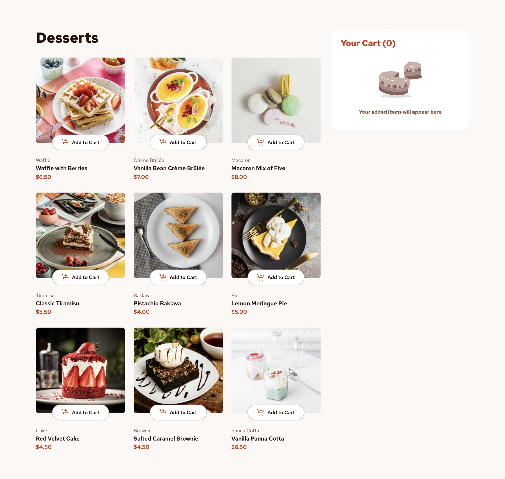

# Product List with Cart

## Table of contents

- [Overview](#overview)
  - [Screenshot](#screenshot)
  - [Links](#links)
- [My process](#my-process)
  - [Built with](#built-with)
- [Author](#author)

## Overview

### Screenshot

### Links

- Solution URL: [Solution URL](https://github.com/kisu-seo/product_list_with_cart)
- Live Site URL: [Live URL](https://kisu-seo.github.io/product_list_with_cart/)

## My process

### Built with

- **React 19** — Component-based architecture with a clear separation of concerns. A Custom Hook (`useCart`) isolates all cart business logic, while dedicated sub-components (`CartItem`, `QuantityControl`, `OrderSummaryItem`, `EmptyCart`) ensure high reusability and maintainability.
- **Vite 8** — Utilized as the fast frontend build tool and development server for near-instant HMR (Hot Module Replacement).
- **Tailwind CSS v3** — Mobile-first approach implemented entirely through utility classes. Design system tokens (custom colors, typography presets via `fontSize`, Red Hat Text font) are centrally managed in `tailwind.config.js`.
- **Semantic HTML5 & Accessibility (A11y)** — Built with accessibility in mind throughout, utilizing semantic tags (`<main>`, `<section>`, `<article>`, `<ul>`, `<li>`), ARIA attributes (`role="dialog"`, `aria-modal`, `aria-labelledby`, `aria-live="polite"`, `role="group"`), and descriptive `aria-label` values on all interactive controls.
- **Responsive Layout** — Mobile-first single-column layout that fluidly transitions to a 2-panel layout on desktop: a 3-column product grid (`md:grid-cols-3`) on the left and a fixed-width cart panel (384px) on the right.
- **Responsive Images** — Uses the HTML `<picture>` element with `<source media="...">` to serve device-optimized images (mobile / tablet / desktop) automatically.

## Author

- Website - [Kisu Seo](https://github.com/kisu-seo)
- Frontend Mentor - [@kisu-seo](https://www.frontendmentor.io/profile/kisu-seo)
